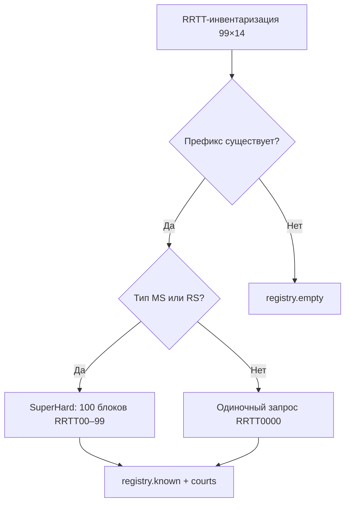

# CourtHarvest2 — CONTEXT

> **Архитектурные решения, обоснования и соглашения проекта.**
> Версия 2.0 — полная переработка Court-Harvester.
> Последнее обновление: Июль 2026

---

## 🎯 Назначение

**CourtHarvest2** — CLI-инструмент для сбора и поддержания эталонного справочника судов РФ через DaData API (suggestions.dadata.ru).

В отличие от v1, которая собиралась итеративно (9 фаз, алфавитный перебор, эвристики), v2 строится на точном знании структуры кодового пространства и гарантированном переборе.

---

## 📐 Ключевые принципы

### 1. Кодовое пространство конечно и известно

Все коды судов имеют формат `RRTTNNNN`:
- `RR` = регион (01–99)
- `TT` = тип суда (14 вариантов: RS, MS, OS, AS, GV, OV, KV, AV, KJ, AJ, AA, AO, VS, AI)
- `NNNN` = номер (0000–9999)

**1 386** возможных комбинаций RRTT. Из них ~396 существуют, остальные гарантированно пусты.

### 2. Полнота через простой перебор, не через умные эвристики

Вместо алфавитного поиска по названиям с maxDepth (v1) — **прямой перебор кодов блоками**.

Блок `RRTTAB` (2 цифры номера) = до 100 кодов. DaData возвращает ≤ 20 результатов, но 100 кодов с ≤ 20 существующими судами — безопасно для всех типов, кроме самых плотных (MS в Москве). В горячих блоках — углубление до 3 цифр.

### 3. MS и RS — единственные «тяжёлые» типы

Анализ собранной базы v1:

| Тип | Суда | Префиксов ~ | MAX (типичный) |
|-----|:----:|:-----------:|:--------------:|
| MS | 5 526 | 80 | 10–150 |
| RS | 1 937 | 85 | 5–50 |
| OS | 68 | 68 | 0 (один на регион) |
| AS | 81 | 81 | 0 |
| Остальные | ~300 | ~80 | 0–5 |

OS, AS, VS, GV и прочие — **1 суд на префикс**, номер = 0000. Их не нужно перебирать блоками, достаточно одного запроса `RRTT0000`.

### 4. SuperHard — единственный режим с гарантией

Обычный refresh (tails) может пропустить суды с разреженной нумерацией (дыра v1 — OS0000, 20 пустых = стоп). SuperHard перебирает всё кодовое пространство MS/RS по 100 блокам — никаких эвристик, никаких пропусков.

**Цена:** 20 000 запросов = 2 ключа = 1 день. Раз в квартал.

---

## 🗂 Режимы работы

### harvest — первичный сбор



### refresh — ежемесячное обновление

> **🧭 В режиме обсуждения.** Будет уточнён после реализации harvest и superhard.

Вопросы к проектированию:
- Что делать при переезде суда? Обновлять адрес молча или сохранять историю?
- Как часто гонять полную ревалидацию? Каждый месяц или раз в полгода?
- Нужна ли команда `diff` для сравнения двух состояний базы?
- Автоматическое обнаружение переименований?

**План после beta:** реализовать и сверить с результатами v1.

### superhard — квартальная верификация

Полный перебор MS/RS по 100 блокам. Не заменяет refresh, а дополняет.

---

## 🧠 Известные уроки из v1

### Проблема OS0000

В v1 `getPrefixStats` возвращал `max = 0` для областных судов (код кончается на 0000). Tails начинали с MAX+1 = 1, а единственный существующий код — 0000. Результат: хвосты и дырки не работали для всего префикса.

**Решение v2:** инвентаризация знает о существовании префикса через `RRTT0000`. Для типов с max=0 не требуется tails — префикс закрыт.

### Проблема 20 пустых подряд

v1 останавливала tails при 20 последовательных пустых ответах. Если реальные суды имели большие разрывы в нумерации (реорганизации, слияния участков), они терялись навсегда.

**Решение v2:** tails использует экспоненциальный probing (MAX+1 → +10 → +50 → +100 → +500) вместо линейного прохода с эвристикой. SuperHard полностью исключает эвристики.

### Проблема дублирования фазовых скриптов

v1 имела 7 почти идентичных скриптов phase4–phase9b с дублированием `getPrefixStats`, `getAllPrefixes`, `main()`. 

**Решение v2:** один унифицированный пайплайн с параметрами (mode, types, depth).

---

## 📁 Структура проекта (план)

```
CourtHarvest2/
├── src/
│   ├── index.ts              CLI точка входа (commander)
│   ├── env.ts                Загрузка .env (без dotenv)
│   ├── core/
│   │   ├── ApiClient.ts      HTTP-клиент + rate limiter + retry
│   │   ├── KeyManager.ts     Ротация ключей
│   │   └── Registry.ts       known/empty/MAX/stats
│   ├── scanners/
│   │   ├── Inventory.ts      RRTT-инвентаризация
│   │   ├── BlockScan.ts      Блочный перебор (RRTT00–99)
│   │   └── Tails.ts          Экспоненциальный поиск хвостов
│   └── types/
│       └── dadata.ts         Типы DaData API
├── keys/                     API-ключи (.env файлы)
├── data/                     Результаты
├── package.json
├── tsconfig.json
├── README.md
├── CONTEXT.md
└── LICENSE
```

---

## ⚙️ Технические решения

### Замена dotenv

Вместо `dotenv` — собственный загрузчик `src/env.ts` (~15 строк). Читает `.env` из рабочей директории, парсит key=value, устанавливает в `process.env`. Нуль зависимостей.

Node.js ≥ 24 также поддерживает флаг `--env-file` — можно запускать без env.ts совсем.

### Module Resolution: bundler

`tsconfig.json` использует `"moduleResolution": "bundler"` — оптимально для tsx. Не требует `.js`-суффиксов в импортах, корректно работает с ESM.

### TypeScript 7 + erasableSyntaxOnly

Флаг `erasableSyntaxOnly` запрещает декораторы и enum (они требуют трансформации, не поддерживаются tsx). Для CLI-утилиты ограничение несущественное.

### Нет eslint

`strict: true` + `noUnusedLocals` + `noUnusedParameters` + `noImplicitReturns` в tsconfig покрывают типичные проверки. Prettier — форматирование. eslint не нужен до появления стабильного `@typescript-eslint` под TS 7.

---

## 🔗 Связанные проекты

| Проект | Связь |
|--------|-------|
| [Court-Harvester](https://github.com/AlexanderKuzikov/Court-Harvester) | v1 — предшественник |
| [Court-Viewer](https://github.com/AlexanderKuzikov/Court-Viewer) | UI для базы |
| [DocuMind](https://github.com/AlexanderKuzikov/DocuMind) | Документооборот — потребитель справочника |
